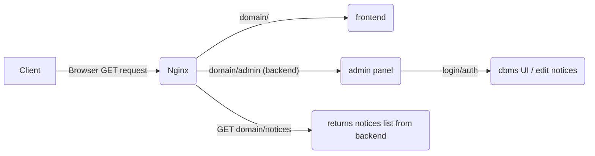

# TSG Noticeboard

**_Under Construction 🏗️_**

## setting up environment variables

The project needs the .env file with dedicated information to function properly.
make the .env file from the **example.env** provided and provide the necessary information (DON'T change the variables' names);

## local deployment

- **DOCKER:** run `docker compose up -d --build` in the cloned repo directory and it'd work well.

  Backend can be accessed on port 5000 and frontend at 3000. (if backend port is unavailable check docker-compose.yaml and ./backend/Dockerfile for a new port setup.)

- **Frontend:** run `npm install` and `npm run dev` inside the **frontend** directory.
- **Backend:** since the backend heavily relies on the docker container, it doesn't have to deployed separately

## Walkthrough

The overall webapp schema is as follows:

## Checklist before deployment

- Note that .env has proper credentials
- admins are added properly in a separate object (don't use admin panel to add admins, not tested yet)
- backend port is not exposed anymore
- port 5173 for vite testing and dev urls are removed in the `app.js` and `api.js`

## More Features to add

1. Attachment upload feature in adminjs adminpanel
2. More fluid animations
3. Search and Filter algos
4. Category type for the notices
5. More customised admin panel (theming and stuff if needed)

## Vulnerabilities

- check commit 69810b7 (logout vulnerability) => scraped, now using adminjs admin panel for a;; the auth works
